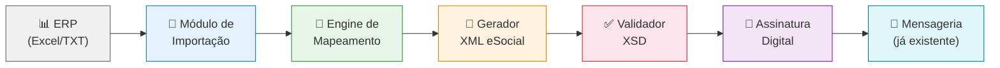

# 📋 Dossiê Técnico — Material eSocial e Viabilidade de Geração de Arquivos XML

## 1. Inventário Completo do Material Disponível

### 1.1 Esquemas XSD (Leiautes de Eventos) — 3 Versões

| Pasta | Data | Qtd. Arquivos | Observação |
|---|---|---|---|
| `2025-11-24_esquemas_xsd_v_s_01_03_00` | 24/11/2025 | 52 | Versão base |
| `2026-02-13_esquemas_xsd_v_s_01_03_00` | 13/02/2026 | 52 | Atualização intermediária |
| `2026-04-27_esquemas_xsd_v_s_01_03_00` | 27/04/2026 | **52** | **Versão mais atual** ✅ |

Todos os 52 arquivos XSD cobrem a totalidade dos eventos do eSocial na versão **S-1.3**. Os arquivos incluem:

#### Eventos de Tabelas (Cadastros Iniciais)
| Arquivo | Evento | Descrição |
|---|---|---|
| `evtInfoEmpregador.xsd` | **S-1000** | Informações do Empregador/Contribuinte/Órgão Público |
| `evtTabEstab.xsd` | **S-1005** | Tabela de Estabelecimentos |
| `evtTabRubrica.xsd` | **S-1010** | Tabela de Rubricas |
| `evtTabLotacao.xsd` | **S-1020** | Tabela de Lotações Tributárias |
| `evtTabProcesso.xsd` | **S-1070** | Tabela de Processos Administrativos/Judiciais |

#### Eventos Não-Periódicos (Trabalhadores)
| Arquivo | Evento | Descrição |
|---|---|---|
| `evtAdmPrelim.xsd` | **S-2190** | Registro Preliminar de Trabalhador |
| `evtAdmissao.xsd` | **S-2200** | Admissão/Ingresso de Trabalhador |
| `evtAltCadastral.xsd` | **S-2205** | Alteração de Dados Cadastrais |
| `evtAltContratual.xsd` | **S-2206** | Alteração Contratual |
| `evtAfastTemp.xsd` | **S-2230** | Afastamento Temporário |
| `evtDeslig.xsd` | **S-2299** | Desligamento |
| `evtReintegr.xsd` | **S-2298** | Reintegração |
| `evtCessao.xsd` | **S-2231** | Cessão/Exercício em Outro Órgão |
| `evtCAT.xsd` | **S-2210** | Comunicação de Acidente de Trabalho |
| `evtMonit.xsd` | **S-2220** | Monitoramento da Saúde do Trabalhador |
| `evtExpRisco.xsd` | **S-2240** | Condições Ambientais do Trabalho |
| `evtTSVInicio.xsd` | **S-2300** | Trabalhador Sem Vínculo - Início |
| `evtTSVAltContr.xsd` | **S-2306** | TSV - Alteração Contratual |
| `evtTSVTermino.xsd` | **S-2399** | TSV - Término |
| `evtCdBenIn.xsd` | **S-2400** | Cadastro de Beneficiário - Início |
| `evtCdBenAlt.xsd` | **S-2405** | Beneficiário - Alteração |
| `evtCdBenTerm.xsd` | **S-2410** | Beneficiário - Término |
| `evtContratAvNP.xsd` | **S-2245** | Contratação Avulso Não Portuário |
| `evtToxic.xsd` | **S-2221** | Exame Toxicológico |
| `evtAnotJud.xsd` | **S-8200** | Anotação Judicial |
| `evtExclusao.xsd` | **S-3000** | Exclusão de Eventos |
| `evtProcTrab.xsd` | **S-2500** | Processo Trabalhista |
| `evtContProc.xsd` | **S-2501** | Informações de Contribuições Decorrentes de Processo Trabalhista |
| `evtExcProcTrab.xsd` | **S-3500** | Exclusão de Eventos - Processo Trabalhista |

#### Eventos Periódicos (Folha de Pagamento)
| Arquivo | Evento | Descrição |
|---|---|---|
| `evtRemun.xsd` | **S-1200** | Remuneração do Trabalhador (RGPS) |
| `evtRmnRPPS.xsd` | **S-1202** | Remuneração do Servidor (RPPS) |
| `evtBenPrRP.xsd` | **S-1207** | Benefícios - Entes Públicos |
| `evtPgtos.xsd` | **S-1210** | Pagamentos de Rendimentos do Trabalho |
| `evtComProd.xsd` | **S-1260** | Comercialização da Produção Rural PF |
| `evtContratAvNP.xsd` | **S-1270** | Contratação de Avulsos |
| `evtInfoComplPer.xsd` | **S-1280** | Informações Complementares ao Período |
| `evtFechaEvPer.xsd` | **S-1299** | Fechamento de Eventos Periódicos |
| `evtReabreEvPer.xsd` | **S-1298** | Reabertura de Eventos Periódicos |

#### Eventos de Retorno (Gerados pelo Governo)
| Arquivo | Evento | Descrição |
|---|---|---|
| `evtBasesTrab.xsd` | **S-5001** | Bases de Cálculo (Trabalhador) |
| `evtBasesFGTS.xsd` | **S-5003** | Bases de FGTS |
| `evtIrrfBenef.xsd` | **S-5002** | IRRF por Trabalhador |
| `evtCS.xsd` | **S-5011** | Contribuições Sociais Consolidadas |
| `evtFGTS.xsd` | **S-5013** | FGTS Consolidado |
| `evtIrrf.xsd` | **S-5012** | IRRF Consolidado |

#### Arquivos de Suporte
| Arquivo | Descrição |
|---|---|
| `tipos.xsd` | **4.633 linhas** — Definição completa de TODOS os tipos de dados, enumerações, validações e regras de negócio |
| `xmldsig-core-schema.xsd` | Schema de assinatura digital XML (W3C) |

---

### 1.2 Documentação PDF (Leiautes Oficiais)

| Documento | Consolidação | Tamanho |
|---|---|---|
| **Leiautes do eSocial v. S-1.3** | Até NT 05.2025 | 18,5 MB |
| **Anexo I - Tabelas** | Até NT 05.2025 | 4,6 MB |
| **Anexo II - Regras** | Até NT 05.2025 | 403 KB |
| **Leiautes do eSocial v. S-1.3** | **Até NT 06.2026 rev.** ✅ | 18,5 MB |
| **Anexo I - Tabelas** | **Até NT 06.2026 rev.** ✅ | 4,6 MB |
| **Anexo II - Regras** | **Até NT 06.2026 rev.** ✅ | 388 KB |

> [!IMPORTANT]
> Estes PDFs contêm a documentação **COMPLETA** de todos os campos, regras de validação, condições de obrigatoriedade, tabelas de domínio (naturezas de rubrica, categorias de trabalhador, motivos de afastamento/desligamento, CBO, países, municípios, etc.)

---

### 1.3 Pacote de Comunicação (v1.6)

| Componente | Descrição |
|---|---|
| **WsEnviarLoteEventos.wsdl** | WSDL para envio de lotes (v1.1.0) |
| **WsConsultarLoteEventos.wsdl** | WSDL para consulta de lotes (v1.1.0) |
| **WsConsultarIdentificadoresEventos.wsdl** | WSDL para consulta de identificadores (v1.0.0) |
| **WsSolicitarDownloadEventos.wsdl** | WSDL para download de eventos (v1.0.0) |
| **EnvioLoteEventos.xsd** | Schema de envio (v1.1.1) |
| **RetornoEnvioLoteEventos.xsd** | Schema de retorno de envio (v1.1.0) |
| **RetornoProcessamentoLote.xsd** | Schema de retorno de processamento (v1.3.0) |
| **ConsultaLoteEventos.xsd** | Schema de consulta (v1.0.0) |
| **RetornoEvento.xsd** | Schema de retorno de evento (v1.3.0) |

---

### 1.4 Documentação Complementar

| Arquivo | Descrição |
|---|---|
| `manualorientacaodesenvolvedoresocialv1-15.pdf` | **Manual de Orientação do Desenvolvedor v1.15** (1,4 MB) — Protocolo de comunicação, certificados, segurança, fluxos |
| `958823-mensagensdosistema-v2-4.pdf` | **Mensagens do Sistema v2.4** (297 KB) — Códigos de erro, mensagens de retorno, tratamento de exceções |
| `entes-federados-responsaveis.csv` | Tabela de Entes Federados Responsáveis (5.598 registros) |

---

## 2. Análise de Viabilidade

### 2.1 Resposta Direta à Pergunta

> **É possível pegar os dados do ERP via planilha Excel ou arquivo TXT extraído do ERP e fazermos a conversão no layout exigido pelo eSocial?**

## ✅ **SIM. É totalmente viável e o material disponível é MAIS QUE SUFICIENTE.**

---

### 2.2 Fundamentação Técnica

#### O que temos disponível vs. O que é necessário

| Requisito | Disponível? | Onde está? |
|---|---|---|
| Layout completo de TODOS os 50+ eventos | ✅ **SIM** | 52 arquivos XSD na pasta `2026-04-27_*` |
| Tipos de dados, validações e restrições | ✅ **SIM** | `tipos.xsd` (4.633 linhas de definições) |
| Regras de negócio e condições de obrigatoriedade | ✅ **SIM** | Documentadas nos próprios XSDs + Anexo II (Regras) |
| Tabelas de domínio (categorias, rubricas, CBO, etc.) | ✅ **SIM** | Anexo I (Tabelas) + tipos.xsd |
| Protocolo de comunicação (envio/consulta) | ✅ **SIM** | Pacote de Comunicação v1.6 (WSDLs + XSDs) |
| Manual do desenvolvedor | ✅ **SIM** | Manual v1.15 |
| Códigos de erro e mensagens | ✅ **SIM** | Mensagens do Sistema v2.4 |
| Assinatura digital (XML Signature) | ✅ **SIM** | `xmldsig-core-schema.xsd` |
| Entes Federados Responsáveis | ✅ **SIM** | CSV com 5.598 registros |

> [!TIP]
> Este material é o **mesmo pacote técnico** utilizado pelos grandes softwares de folha de pagamento do mercado (TOTVS, Senior, ADP, etc.) para gerar os arquivos XML do eSocial.

---

### 2.3 Arquitetura Proposta (Visão Geral)



#### Fluxo proposto:
1. **Importação**: Leitura do Excel/TXT do ERP com mapeamento de colunas
2. **Mapeamento**: Conversão dos dados do ERP para os campos do eSocial conforme XSDs
3. **Geração XML**: Construção dos XMLs dos eventos usando os schemas como blueprint
4. **Validação**: Validação contra os XSDs antes do envio (pré-validação local)
5. **Assinatura**: Assinatura digital XML (certificado A1 já configurado no projeto)
6. **Envio**: Integração com a mensageria já existente no projeto

---

### 2.4 Eventos Prioritários (Cenário Típico de Folha Mensal)

Para uma operação mensal típica, os eventos mínimos necessários são:

| Prioridade | Evento | Descrição | Complexidade |
|---|---|---|---|
| 🔴 P0 | S-1000 | Info do Empregador | Baixa |
| 🔴 P0 | S-1005 | Estabelecimentos | Baixa |
| 🔴 P0 | S-1010 | Rubricas | Média |
| 🔴 P0 | S-1020 | Lotações | Baixa |
| 🟡 P1 | S-2200 | Admissão | Alta |
| 🟡 P1 | S-2299 | Desligamento | Alta |
| 🟡 P1 | S-2230 | Afastamento | Média |
| 🔴 P0 | **S-1200** | **Remuneração (Folha)** | **Alta** |
| 🔴 P0 | **S-1210** | **Pagamentos** | **Média** |
| 🔴 P0 | S-1299 | Fechamento | Baixa |
| 🟢 P2 | S-2210 | CAT | Média |
| 🟢 P2 | S-2220 | ASO/Monitoramento | Média |
| 🟢 P2 | S-2240 | Condições Ambientais | Alta |

---

### 2.5 O Que o ERP Precisa Fornecer (Dados Mínimos por Evento)

#### Para S-1200 (Remuneração — evento mais crítico):
```
CPF do trabalhador
Matrícula
Código de categoria (Tabela 01)
Período de apuração (AAAA-MM)
Código da lotação (S-1020)
Código do estabelecimento (S-1005)
Para CADA rubrica:
  - Código da rubrica (S-1010)
  - Identificador da tabela de rubrica
  - Valor da rubrica
  - Indicativo de apuração IR
```

#### Para S-2200 (Admissão — evento mais complexo):
```
CPF, Nome, Sexo, Raça/Cor, Grau de Instrução
Data de nascimento, País de nascimento, Nacionalidade
Endereço completo (CEP, logradouro, número, bairro, município, UF)
Matrícula, Tipo de regime trabalhista, Tipo de regime previdenciário
Data de admissão, Tipo de admissão
Tipo de registro de jornada, Natureza da atividade
CNPJ do sindicato
Nome do cargo, CBO do cargo, Código de categoria
Salário fixo, Unidade salarial
Tipo de contrato, Duração
Local de trabalho (CNPJ/CNO/CAEPF do estabelecimento)
Horário contratual (jornada, tipo)
Dependentes (opcional)
Deficiência (se aplicável)
```

---

## 3. Análise de Complexidade e Riscos

### 3.1 Complexidades Identificadas

| Aspecto | Nível | Detalhamento |
|---|---|---|
| **Validações cruzadas** | 🔴 Alta | Os XSDs possuem dezenas de regras `REGRA:*` que fazem validações cruzadas entre eventos (ex: rubrica precisa existir em S-1010 antes de usar em S-1200) |
| **Sequência de envio** | 🟡 Média | Eventos de tabelas (S-1000, S-1005, S-1010, S-1020) **DEVEM** ser enviados ANTES dos eventos periódicos |
| **Assinatura digital** | 🟢 Baixa | Já implementada no projeto atual |
| **Mapeamento ERP → eSocial** | 🔴 Alta | Depende do layout específico do ERP; cada ERP exporta de forma diferente |
| **Tabelas de domínio** | 🟡 Média | Necessário carregar e validar contra tabelas oficiais (CBO, municípios, países, categorias, etc.) |

### 3.2 Riscos e Mitigações

| Risco | Impacto | Mitigação |
|---|---|---|
| Layout do ERP mudar sem aviso | Alto | Criar configuração flexível de mapeamento (JSON/YAML) |
| Dados incompletos no ERP | Alto | Validação pré-envio + relatório de pendências |
| Sequência errada de envio | Médio | Engine de ordenação automática de eventos |
| Rejeições do governo | Médio | Parser de retornos com mensagens claras (doc v2.4 já disponível) |

---

## 4. Compatibilidade com o Projeto Atual

O projeto **Mensageria eSocial** já possui:

| Capacidade | Status | Reutilizável? |
|---|---|---|
| Backend FastAPI (Python) | ✅ Funcional | Sim — módulo de geração XML se encaixa |
| Frontend React + Vite | ✅ Funcional | Sim — tela de importação/mapeamento |
| Certificado digital A1 | ✅ Configurado | Sim — para assinatura dos XMLs |
| Envio de lotes via SOAP | ✅ Funcional | Sim — o XML gerado alimenta diretamente |
| Consulta de retornos | ✅ Funcional | Sim — sem alterações |
| Geração de PDFs (recibos) | ✅ Funcional | Sim — pode gerar relatório de pendências |

---

## 5. Estimativa de Esforço

| Fase | Descrição | Esforço Estimado |
|---|---|---|
| **Fase 1** | Módulo de importação (Excel/TXT parser) | Médio |
| **Fase 2** | Gerador XML para eventos de tabelas (S-1000, S-1005, S-1010, S-1020) | Baixo-Médio |
| **Fase 3** | Gerador XML para S-1200 (Remuneração) + S-1210 (Pagamentos) | Alto |
| **Fase 4** | Gerador XML para eventos não-periódicos (S-2200, S-2299, S-2230) | Alto |
| **Fase 5** | Validação XSD local + relatório de pendências | Médio |
| **Fase 6** | Interface de configuração de mapeamento (Frontend) | Médio |
| **Fase 7** | Demais eventos (SST, processos trabalhistas, etc.) | Incremental |

---

## 6. Conclusão Final

> [!IMPORTANT]
> ### Veredicto: ✅ **TOTALMENTE VIÁVEL**
> 
> O material disponível na pasta `Material eSocial` é **completo, oficial e atualizado** (versão S-1.3, consolidada até NT 06.2026 rev.). Ele contém:
> 
> - **52 schemas XSD** com a definição exata de cada campo, tipo de dado, validação e regra de negócio
> - **Documentação oficial** com mais de 23 MB de leiautes, tabelas e regras
> - **Pacote de comunicação** completo com WSDLs e XSDs de envelope
> - **Manual do desenvolvedor** e **mensagens do sistema** para tratamento de erros
> 
> Com este material, é possível implementar um gerador de XML que:
> 1. Leia dados de planilhas Excel ou arquivos TXT exportados do ERP
> 2. Mapeie os dados para os campos exigidos pelo eSocial
> 3. Gere XMLs válidos e conformes com os schemas oficiais
> 4. Valide localmente antes do envio (pré-validação)
> 5. Alimente diretamente o módulo de mensageria já existente no projeto
> 
> ---
> 
> ### Ponto de Atenção Crítico
> 
> O sucesso desta implementação depende **diretamente** da qualidade e completude dos dados exportados pelo ERP. Será necessário:
> 
> 1. **Obter um arquivo de exemplo** (Excel ou TXT) exportado do ERP com os dados reais
> 2. **Mapear campo a campo** a correspondência entre o layout do ERP e os campos exigidos pelo eSocial
> 3. **Identificar gaps** — dados que o eSocial exige mas que o ERP não fornece
